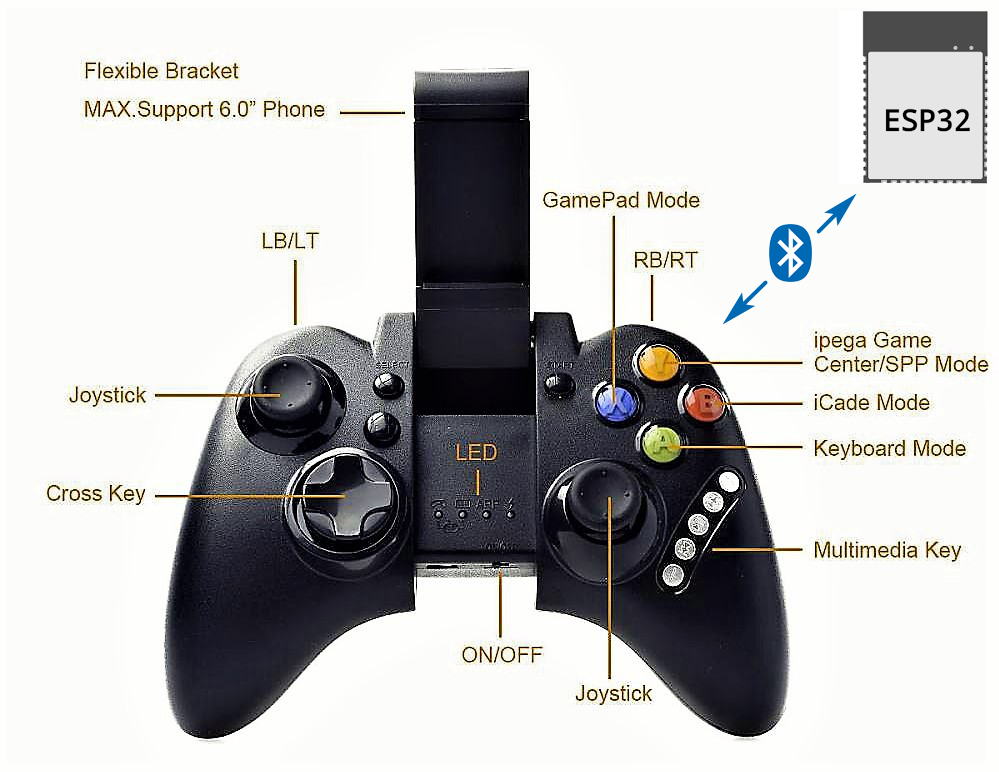
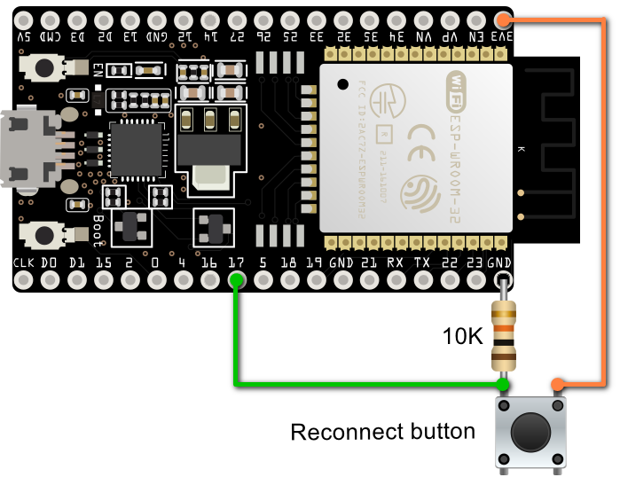

# iPega PG-9021 + ESP32



<p>A bluetooth gamepad "host" for the ESP32.</p>
<p>Based on BTStack v1.1 example "external\btstack\example\hid_host_demo.c".</p>
<p>I am not C++ programmer, sorry for my code ;).</p>

## Features

* Supports all buttons
* Supports keyboard mode (Joystick 0 or 1 + all buttons)
* Supports gamepad mode (Joystick from 127 to 0, from 127 to 255 + all buttons)
* <s>Supports iCade</s>
* Values received from the joystick are smooth out (got rid of 154,155,154,155...)
* Added a physical button to reconnect to a gamepad

## Joysticks values

* top - from 127 to 0
* down - from 127 to 255
* left - from 127 to 0
* right - from 127 to 255

## Wiring



## How to compile it

1. Install ESP-IDF

Install the ESP32 toolchain. Use version **4.1** or newer.

* https://docs.espressif.com/projects/esp-idf/en/latest/esp32/get-started/

2. Clone repo

```
$ git clone https://gitlab.com/overplex/pg9021.git
$ cd pg9021
$ git submodule update --init
```

3. Integrate BTStack into ESP32

```
$ cd external/btstack/port/esp32
$ ./integrate_btstack.py
```

4. Compile pg9021

```
$ cd ../../../../src
$ make -j
```

5. Flash it

```
$ make flash monitor
```

## Troubleshooting

If you see error:

```
L2CAP Connection failed: 0x6a
```

1. Try erasing flash memory:

```
esptool.py --port /dev/ttyUSB0 erase_flash
```

2. Then disable saving keys to flash memory in {YOUR_ESP_IDF_DIR}\components\btstack\include\btstack_config.h

```
#define NVM_NUM_LINK_KEYS 0
```

3. Rebuild (in pg9021/src)

```
make -j
```

4. Flash it

```
$ make flash monitor
```

## License

pg9021 is open source, [licensed under Apache 2][apache2].

However pg9021 depends on the great [BTStack library][btstack-github]. Which is free to use for
open source projects. But commercial for closed-source projects.
[Contact them for details][btstack-homepage]. They are very friendly + helpful
(I’m not affiliated with them).

[btstack-github]: https://github.com/bluekitchen/btstack
[apache2]: https://www.apache.org/licenses/LICENSE-2.0
[btstack-homepage]: https://bluekitchen-gmbh.com/
